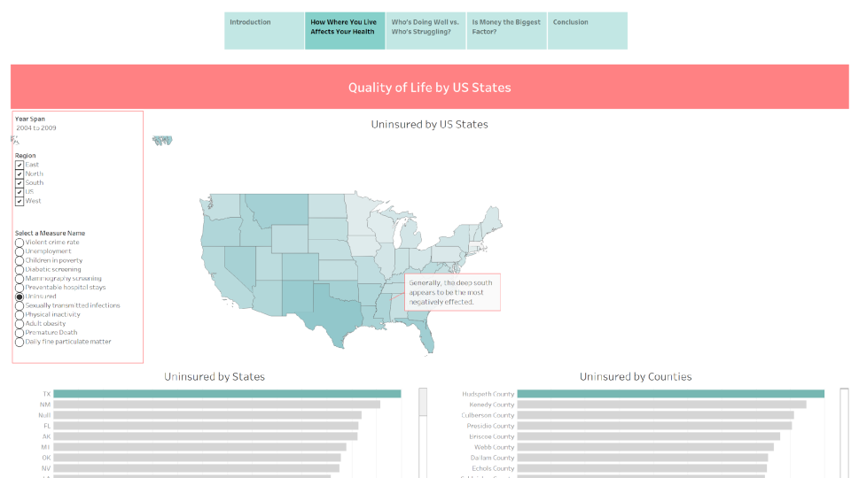

# U.S. Health Outcomes & Social Determinants Analysis

Interactive Tableau dashboard exploring **U.S. health outcomes, healthcare access, social determinants of health, and state-level disparities** using public health indicators and demographic metrics.

🔗 **Live Tableau Dashboard:**  
https://public.tableau.com/views/USHealthOutcomesSocialDeterminantsAnalysis/Dashboard4

---

## Project Overview

This project analyzes how **social, economic, and environmental factors influence health outcomes across U.S. states and counties.**

The dashboard investigates questions such as:

- How does geography affect health outcomes?
- Which states are performing well versus struggling?
- Are income and social conditions linked to life expectancy?
- Is money the strongest predictor of health outcomes?
- How do healthcare access and environmental factors contribute?

The goal was to uncover patterns behind **health inequality, quality of life, and population health outcomes** through interactive visualization.

---

## Dashboard Sections

### 1. Introduction

Overview of the project scope and health-ranking analysis across the United States.

Introduces key themes:

- Quality of life
- Healthcare access
- Social determinants
- Public health disparities

---

### 2. How Where You Live Affects Your Health

Examines geographic differences in health outcomes across states and counties.

Key analyses include:

- Uninsured populations by state
- Uninsured populations by county
- Regional comparisons
- Geographic health disparities

Insights suggest that location strongly influences healthcare access and quality of life.

---

### 3. Who's Doing Well vs. Who's Struggling?

Compares health outcomes between stronger-performing and weaker-performing states.

Visualizations explore:

- Preventable deaths
- Health rankings
- Income, education, and crime indicators
- Social determinant patterns

The dashboard highlights how health inequality varies significantly across regions.

---

### 4. Is Money the Biggest Factor?

Explores relationships between economic conditions and health outcomes.

Analyses include:

- Income vs life expectancy
- State health rankings
- Longitudinal improvement trends
- Poverty and socioeconomic indicators

Findings show strong relationships between economic conditions and population health.

---

### 5. Conclusion

Summarizes major findings and practical implications for:

- Government policy
- Public health investment
- Healthcare access
- Community-level interventions

The dashboard emphasizes that health outcomes are shaped by broader social systems — not only medical care.

---

## Dataset

Dataset source:

**Tableau Sample Data Library**

https://public.tableau.com/app/learn/sample-data

The project uses public-health related sample datasets provided through Tableau's learning resources.

---

## Tools & Technologies

- Tableau Public
- Interactive Dashboards
- Data Visualization
- Business Intelligence
- Public Health Analytics
- Exploratory Data Analysis (EDA)

---

## Key Skills Demonstrated

- Dashboard Design
- Data Storytelling
- Interactive Visualization
- Business Intelligence Reporting
- Public Health Analytics
- Comparative Analysis
- KPI Visualization
- Trend Analysis
- Geographic / Regional Analysis

---

## About This Project

Originally developed as part of advanced data visualization coursework and later refined for professional portfolio presentation.

Dashboard design, analysis, storytelling structure, and implementation completed by **Agilan Sivakumaran**.

---
